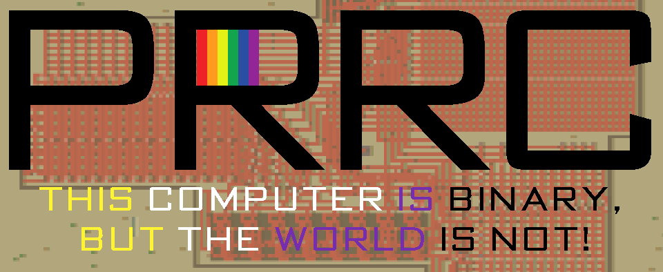
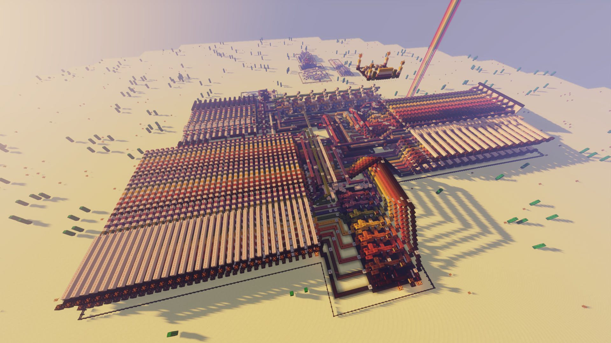
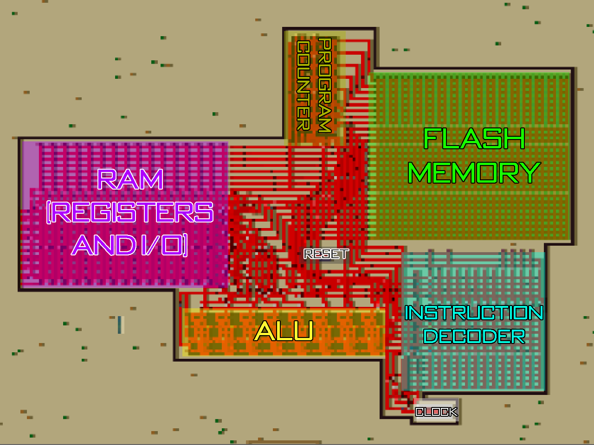

<h1 align="center">Programmable Rainbow Redstone Computer</h1>

<p align="center">
    
</p>

<div style="width:100%;text-align:center;">
    <p align="center">
        <a href="https://twitter.com/fern_hertz"></a>
        <a href="https://youtu.be/6nqyTfuWk78"></a>
        <a href="https://youtu.be/-WHM7oyI7bc"></a>
        <a href="https://github.com/XxOinvizioNxX/PRRC/stargazers"></a>
        <a href="https://github.com/XxOinvizioNxX/PRRC/releases"></a>
    </p>
</div>

## Table of contents

- [What is it?](#what-is-it)
- [How to use it](#how-to-use-it)
  - [Flash memory](#flash-memory)
  - [Program counter](#program-counter)
  - [RAM (Registers 1-15 and 17-30)](#ram-registers-1-15-and-17-30)
  - [Digital inputs/outputs (Registers 16 and 31)](#digital-inputsoutputs-registers-16-and-31)
  - [NULL register (Register 0)](#null-register-register-0)
  - [ALU (Arithmetic Logic Unit)](#alu-arithmetic-logic-unit)
  - [Reset](#reset)
  - [Clock](#clock)
- [Program flasher](#program-flasher)
  - [Example 1 (with YouTube demo)](#example-1-comparing-two-numbers)
  - [Example 2](#example-2-integer-division-between-8-bit-numbers-register-16-divide-by-31)
  - [Example 3 (with YouTube demo)](#example-3-ticker)

----------

## What is it?

PRRC is Programmable Rainbow Redstone Computer. This is my first 8-bit computer built in Minecraft that can be programmed in assembler. The program can be flashed using a Python script that places torches in accordance with the specified bits

Some specs:
- **Clock frequency:** 0.2Hz
- **Registers:** 30 (27 regular registers + 2 I/O + 1 Carry IN/OUT) (expands up to 256)
- **Digital inputs/outputs:** 2 registers x 8 bits = 16
- **Flash size:** 64 commands x 19 bits (expands up to 256 x 19)
- **Assembler commands:** 8 (PUT, MOV, JMP, BRC, NOR, AND, ADD, ADC)

<p align="center">
    
</p>

----------

## How to use it

<p align="center">
    
</p>

### Flash memory

The program writes in assembly language. Each command consists of 19 bits
- 3 bits of instruction
  - 0 (0x000) - PUT Rd N  - Write 8-bit number N to the register with 8-bit address Rd
  - 1 (0x001) - MOV Rd Rs - Copy number from register Rs to register Rd
  - 2 (0x010) - JMP Addr. - Jump to the 8-bit Addr. address
  - 3 (0x011) - BRC Addr. - Jump to the 8-bit Addr. address if carry bit is set
  - 4 (0x100) - NOR Rd Rs - Logic NOR operation between Rd and Rs. The result will be written to Rd
  - 5 (0x101) - AND Rd Rs - Logic AND operation between Rd and Rs. The result will be written to Rd
  - 6 (0x110) - ADD Rd Rs - Arithmetic addition of Rd to Rs without carry bit. The result will be written to Rd
  - 7 (0x111) - ADC Rd Rs - Arithmetic addition of Rd to Rs with carry bit. The result will be written to Rd
- 8 bits (1 byte) of first argument. By default connected to the RAM address bus. Can be connected to Program counter register (in JMP or BRC instructions)
- 8 bits (1 byte) of second argument. Can be connected to the data bus or RAM address bus

### Program counter

A register that stores the current instruction address for program memory. After executing commands 0 to 1 and 4 to 7, it adds 1 to the address. The address can be manually assigned using JMP (2) or BRC (3) commands. If no carriage has been set when the BRC command is executed, the current address will be incremented without assignment

### RAM (Registers 1-15 and 17-30)

29 bytes of RAM (registers) are available for program execution.
Register 1 also used for Carry bit. If a carriage return was performed while performing the addition, it will be written as the last bit in the register 1 (0b00000001). When writing, the remaining bits of the register are not affected

### Digital inputs/outputs (Registers 16 and 31)

In the current version of the computer, 2 registers are available as input / output ports (Register 16 (0b00010000) and register 31 (0b00011111)). Each of the two registers has 8 external inputs and 8 external outputs. To read / write digital ports, the same functions are used as for regular registers

For example, to turn on the lamp on the least significant bit of register 31, just execute command `PUT 31 1`

Reading from this registry copies the data from the levers

### NULL register (Register 0)

0 address does not exist and this register cannot be accessed. The 0th register is used exclusively as a buffer when copying from one register to another

### ALU (Arithmetic Logic Unit)

ALU is the heart of the computer. It performs logical and arithmetic operations. The current version supports 3 operations that ALU performs:
- NOR. Logic NOR operation (Not-OR)
- AND. Logic AND operation
- ADD (ADC). Arithmetic addition

### Reset

After setting the reset, the entire computer stops, the contents of the RAM and the instruction decoder are cleared, the 0th address of the program memory is set

### Clock

The current version of PRRC uses 0.2 Hz redtone clock. You can slow it down without any problem, but speeding up can cause problems due to slow redstone transmission

----------

## Program flasher

You can program PRRC directly in Minecraft by manually setting bits in program memory using redstone torches. This is similar to the very ancient memory of the first real computers.

But to simplify programming, I wrote a Python script in which you can write instructions in assembler and get a commands for command blocks that will put the torches in the right positions for you.

The `Uploader.py` script does not use any third party libraries. **And it can be run using the online Python compiler such as programiz, onlinegdb or any other python compiler.** Just copy the code from GitHub into the IDE, write your code according to the example, and run the file. As a result, you will receive a program memory map of bits, as well as commands for 4 command blocks. These commands must be pasted into the corresponding command blocks on the spawn and press the `WRITE PROGRAM` button. After pressing the button, clearing the memory and recording the program will start automatically. You do not need to run each part of the bootloader separately, after the end of the first write sequence, the next command block will be automatically launched

### Example 1. Comparing two numbers

```
'MOV 2 31',     # 0 - Copy digital input register 31 (2nd number) to the register 2
'NOR 2 2',      # 1 - Invert value in register 2 (invert 2nd number)
'ADD 2 16',     # 2 - Add 1st number (digital input register 16) to the register 2
'BRC 5',        # 3 - Goto 5 if carry is set (1st number > 2nd number)
'JMP 7',        # 4 - Goto 7 (skip 5, 6) if no carry (1st number <= 2nd number)
'PUT 31 1',     # 5 - Light up first lamp on digital output (register 31) (1st number > 2nd number)
'JMP 14',       # 6 - Goto 14 to finish the program
'PUT 3 1',      # 7 - Write 1 to register 3 (for next addition)
'ADD 2 3',      # 8 - Add 1 to previous result (if a carry appears, the numbers are equal)
'BRC 11',       # 9 - Goto 11 if carry is set (1st number == 2nd number)
'JMP 13',       # 10 - Goto 13 (skip 11, 12) if no carry (1st number < 2nd number)
'PUT 31 3',     # 11 - Light up both lamps on digital output (register 31) (1st number = 2nd number)
'JMP 14',       # 12 - Goto 14 to finish the program
'PUT 31 2',     # 13 - Light up second lamp on digital output (register 31) (1st number < 2nd number)
'JMP 14'        # 14 - Goto 14 to make infinite loop
```

Demo on YouTube:

[](https://www.youtube.com/watch?v=6nqyTfuWk78)

### Example 2. Integer division between 8-bit numbers (register 16 divide by 31)

```
'PUT 2 1',      # 0 - 1 (0b00000001) constant
'MOV 3 16',     # 1 - Copy 1st number (from digital input register 16)
'MOV 4 31',     # 2 - Copy 2nd number (from digital input register 31)
'NOR 4 4',      # 3 - Invert value in register 4 (invert 2nd number to make subtraction for loop)
'ADD 5 2',      # 4 - Increment answer by 1
'ADD 3 4',      # 5 - Subtract 2nd number from previous result
'BRC 8',        # 6 - Continue loop if no carry
'JMP 10',       # 7 - Exit from loop and write the answer
'ADD 3 2',      # 8 - Add 1 (from register 2) to complete subtraction
'JMP 4',        # 9 - Another loop entry
'MOV 16 5',     # 10 - Copy answer to the digital output (register 16)
'JMP 11'        # 11 - Goto 11 to make infinite loop
```

### Example 3. Ticker

A program that switches sequentially the lamps in the output register

```
'PUT 1 1',      # 0 - Initial state (start from 00000001)
'ADC 2 2',      # 1 - Add the number to itself with carry
'MOV 16 2',     # 2 - Copy to register 16 (digital output)
'JMP 1'         # 3 - Jump to 1 to make infinite loop
```

Demo on YouTube:

[](https://www.youtube.com/watch?v=-WHM7oyI7bc)
